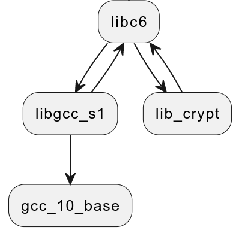
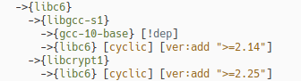

# deb-repo-test

This is realisation for AstraLinux test task for the position of maintainer. The test includes a main and
additional task.

Main task of the test:

> Write a script in bash or python to download from the debian "bullseye" repository and automatically build
> from sources of several packages (bash gawk sed) and their build dependencies in pure debootstrap from
> debian bullseye repository. The result must be formatted as a deb package, and supplemented with comments.

Additional task:

> Consider the issue (possible only in theory) of ordering dependencies, breaking cyclic dependencies
> and formation of the assembly order.

# Terms and abbreviation

`vreq` -- version requirement string (e.g. "(>= 2.14)")

`pkg` -- package, in this work - actually just deb file

`dependant`, `depends` -- package specied in "Depends" field (in `DSC` for source packages case)

`cyclic dependency` -- specail type of graph edge, see [arch notes](#architecture-notes)

# Architecture notes

## Depends parsing

Depends parsing goals:

1. Obtain all package dependans, dependans of dependants and so on.
2. Detect any cyclic references.
3. Correctly work with version requirements.

Next image give you an idea with that we deal off.

{#fig:perl-tree}

For the fun i will try to acchive all goals with single depends tree walk. Let's me explain what this mean
on practice. As you see depend's graph for `perl` package contains multiple references to `libc6` as depend.
Some of these references is cyclic edges.

Also, each reference may contains own version requirement (i.e. `libcrypt` and `libdb` may have different
version constraints). This constraints may be compatible and may not.

Long story short, during walking on this kind of depend's graphs we get following issues:

1. Cyclic edges needed to be process in way.
2. Version constraints is needed to be rewritten at every occurs. Once again, we must rewrite every
   constraint for `libc6` across whole depend's graph.

There are two ways to do this, easy and hard. Easy one is:

1. Walk thru depend's graph and collect info for all nodes.
2. Detect cyclic edges. This is can be acchived easily, as we know about all nodes.
3. Accumulate all version constrains and compose them to one suitable.

Hard and most interesting way is done all in one iteration. For cyclic edges we will do:

1. During walk try to detect cyclic edges, then mark end nodes of cycle.
2. Rewind call stack to fist occurrence of node generating cyclic edge. This is needed to ensure that
   processed portion of depend's tree doesn't contains a covering cycle.

And for a version restriction we will doing in similar way - rewinding the call stack.

## Unspinning depends

Similar to the construction of the graph itself, to build the order of satisfaction of dependencies, two
ways are seen - the easy one and the fun.

The easy way is to use `find` command, as we already have graph representation mirrored in dir structure.
For `autoconf` case `find -type d` will produce:

```sh
❯❯❯ find -type d
./autoconf
./autoconf/perl
./autoconf/perl/perl-base
./autoconf/perl/perl-modules-5.32
./autoconf/perl/perl-modules-5.32/perl-base
./autoconf/perl/libperl5.32
./autoconf/perl/libperl5.32/libbz2-1.0
./autoconf/perl/libperl5.32/libbz2-1.0/libc6
./autoconf/perl/libperl5.32/libbz2-1.0/libc6/libgcc-s1
./autoconf/perl/libperl5.32/libbz2-1.0/libc6/libgcc-s1/gcc-10-base
./autoconf/perl/libperl5.32/libbz2-1.0/libc6/libgcc-s1/libc6
./autoconf/perl/libperl5.32/libbz2-1.0/libc6/libcrypt1
./autoconf/perl/libperl5.32/libbz2-1.0/libc6/libcrypt1/libc6
./autoconf/perl/libperl5.32/libc6
./autoconf/perl/libperl5.32/libcrypt1
./autoconf/perl/libperl5.32/libdb5.3
./autoconf/perl/libperl5.32/libdb5.3/libc6
./autoconf/perl/libperl5.32/libgdbm-compat4
./autoconf/perl/libperl5.32/libgdbm-compat4/libc6
./autoconf/perl/libperl5.32/libgdbm-compat4/libgdbm6
./autoconf/perl/libperl5.32/libgdbm-compat4/libgdbm6/libc6
./autoconf/perl/libperl5.32/libgdbm6
./autoconf/perl/libperl5.32/zlib1g
./autoconf/perl/libperl5.32/zlib1g/libc6
./autoconf/perl/libperl5.32/perl-modules-5.32
./autoconf/m4
./autoconf/m4/libc6
./autoconf/m4/libsigsegv2
./autoconf/m4/libsigsegv2/libc6
./autoconf/debianutils
```

All that's left to do now:

1. Count '/' in a string.
2. Sort rows in ascending order by '/'.
3. Add newly encountered elements to the list, checking for the presence of a '.cyclic' file inside.
4. If there is a '.cyclic', the node is not added (so the dependency source will definitely be higher).
5. Enjoin our depends list.

Depend solving in following order:

The Path of Suffering is working with a `.flatten`, once you've collected it. We do something like this:

1. Select a range containing the entire branch from the root.
2. Run in ascending level collecting unique elements.

> Remember to process root nodes in the same order they are declared, see [bugs](#bugs-caveats-limitations).

## Cyclic depends

When a cycle is encountered, we fold it into a flat in the following order:

1. Remember the current level and add the dependency specification to a separate list.
2. While the level is growing - we continue to add specifications there.
3. As soon as the level has become less than the level of the beginning of the cycle - all done and our
   cycle is expanded.

::: {#fig:cycle-ex layout-ncol=2}

{width=20%}
{width=72%}

cyclic depend: a) themself, b) reaction of the script
:::

For example, in cyclic depends like shown resulting flat list will be as:

```sh
libc6 libgcc-s1 libgcc1 gcc-10-base libcrypt1
```

## Realisation details

See docs.

# Working environment

As I working within NixOS usage of debian native build stack is a kind tricky. So, to get a working
environment I use combination of NixOS development shell and `direnv` to automate updating and starting
containers. See [flake.nix](./vms/flake.nix) for implementation details.

To use the environment:

1. cd to `vms` folder
2. wait for `direnv` invoke `nix flake` and rebuild (if needed) containers, packages, scrips
3. use `run-debian-bullseye [bg]` to run container with or without enter into as user `mtain` (or
    `root`)
4. work inside container or use ssh to connect from host

# Installation

Binary package is `sh-dpkg_0.0.1~alpha_amd64.deb`. To build package you need an working docker container
named 'debian'. If so, build package with `make deb`. To rebuild documentation - use `make build_doc`.

# Usage

`sh-dpkg` can be executed in two ways, inside (default) or outside of debian (using docker as backend). To
use docker backend specify `--docker` option to `sh-dpkg`. For realisation details see
[docker.sh](./docs/docker.md), [lcrun.sh](./docs/lcrun.md), [bkend.sh](./docs/bkend.md). Also,`sh-dpkg`
splits the whole work to separated stages, see [stage.sh](./docs/stage.md).

Work stages are:

1. Gathering the source `sh-dpkg source [opts] <pkg>` to gather the source.
2. Building depends tree `sh-dpkg tree [opts] <pkg>`.
3. Composing depends tree `sh-dpkg walk [opts] <pkg>`.
4. Downloading build-depends and it depends `sh-dpkg dload [opts] <pkg>`.
5. Installing depends `sh-dpkg inst [opts] <pkg>`.
6. Building package `sh-dpkg deb [opts] <pkg>`.
7. Uninstalling depends  `sh-dpkg purge [opts] <pkg>`.

And few special targets: `sh-dpkg all [opts] <pkg>` to do all in once, and
`sh-dpkg clear [opts] <stage> <pkg|all>` clear all results.

Accepted options is:

1. `--local` (default) to run script locally
2. `--docker` to use docker backend.
3. `--force` to mandatory rerun stage

For example ,results of `tree` stage looks like:

```sh bash
❯❯❯ make-repo
[bash]: dirs ...
[bash]: sources ...
[bash]: build-reqs ...
{bash autoconf}
  ->{perl}
    ->{perl-base} [!dep]
    ->{perl-modules-5.32}
      ->{perl-base} [!dep]
    ->{libperl5.32}
      ->{libbz2-1.0}
        ->{libc6}
          ->{libgcc-s1}
            ->{gcc-10-base} [!dep]
            ->{libc6} [cyclic]
          ->{libcrypt1}
            ->{libc6} [cyclic]
      ->{libc6} [+libc6]
      ->{libcrypt1} [+libcrypt1]
      ->{libdb5.3}
        ->{libc6} [+libc6]
      ->{libgdbm-compat4}
        ->{libc6} [+libc6]
        ->{libgdbm6}
          ->{libc6} [+libc6]
      ->{libgdbm6} [+libgdbm6]
      ->{zlib1g}
        ->{libc6} [+libc6]
      ->{perl-modules-5.32} [+perl-modules-5.32]
  ->{m4}
    ->{libc6} [+libc6]
    ->{libsigsegv2}
      ->{libc6} [+libc6]
  ->{debianutils} [!dep]
{bash autotools-dev} [!dep]
{bash bison}
  ->{m4} [+m4]
  ->{libc6} [+libc6]
```

# Bugs, caveats, limitations

Dependant alternate specification (i.e. "`pkg_a` (`vreq`) | `pkg_b` (`vreq`)") not supported. For now both
packages will be considered as depends.

Current version's maths not cover case if version requirements specified as bot sided inequality (i.g.
"libc6 (>> 2.14), libc6 (<< 2.15)")

Version specification rewrite for end nodes of graph not supported, script just leave end nodes as is (see
`taksSumVreq` for details).

For educational purposes, nodes whose dependencies have already been processed are not added to the
`.flatten`, respectively, the branches below the first root are not complete and cannot be processed
independently. In a normal implementation, of course, nodes already encountered should be supplemented.

# References
