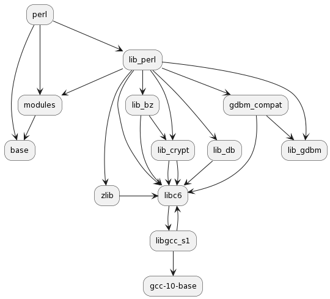

# deb-repo-test

This is realisation for AstraLinux test task for the position of maintainer. The test includes a main and
additional task.

Main task of the test:

> Write a script in bash or python to download from the debian "bullseye" repository and automatically build
> from sources of several packages (bash gawk sed) and their build dependencies in pure debootstrap from
> debian bullseye repository. The result must be formatted as a deb package, and supplemented with comments.

Additional task:

> Consider the issue (possible only in theory) of ordering dependencies, breaking cyclic dependencies
> and formation of the assembly order.

# Terms and abbreviation

`vreq` -- version requirement string (e.g. "(>= 2.14)")

`pkg` -- package, in this work - actually just deb file

`Dependant` -- package specied in "Depends" field (`DSC` in source packages case, package meta in binary case)

`Cyclic dependency` -- specail type of graph edge, see [arch notes](#architecture-notes)

# Architecture notes

Depends parsing goals:

1. Obtain all package dependans, dependans of dependants and so on.
2. Detect any cyclic references.
3. Correctly work with version requirements.

Next image give you an idea with that we deal off.

{#fig:perl-tree}

For the fun i will try to acchive all goals with single depends tree walk. Let's me explain what this mean
on practice. As you see depend's graph for `perl` package contains multiple references to `libc6` as depend.
Some of these references is cyclic edges.

Also, each reference may contains own version requirement (i.e. `libcrypt` and `libdb` may have different
version constraints). This constraints may be compatible and may not.

Long story short, during walking on this kind of depend's graphs we get following issues:

1. Cyclic edges needed to be process in way.
2. Version constraints is needed to be rewritten at every occurs. Once again, we must rewrite every
   constraint for `libc6` across whole depend's graph.

There are two ways to do this, easy and hard. Easy one is:

1. Walk thru depend's graph and collect info for all nodes.
2. Detect cyclic edges. This is can be acchived easily, as we know about all nodes.
3. Accumulate all version constrains and compose them to one suitable.

Hard and most interesting way is done all in one iteration. For cyclic edges we will do:

1. During walk try to detect cyclic edges, then mark endpoits of cycle.
2. Rewind call stack to fist occurrence of node generating cyclic edge. This is needed to ensure that
   processed portion of depend's tree doesn't contains a covering cycle.

And for a version restriction we will doing in similar way - rewinding the call stack.

# Preparing environment

As I working within [NixOS](https://nixos.org/) usage of debian native build stack is a kind tricky. The
main difficulty lies in the side effects of the storage system when we trying to chroot in debootstraped
guest system. For extra fun, as if the `NixOS` FHS incompatibility wasn't enough, the `debootstrap` utility
appears to be broken and abandoned. Well, having fun is having fun, so ...

Since we need a working environment for the Debian build stack, the obvious solution is to use qemu guest
and do all the work inside.

However, I am implementing another option - creating a working environment using NixOS (development shell
inside `nix flake`) with the necessary docker containers inside the environment and automated logging into
(`direnv`), updating and starting containers. See [flake.nix](./vms/flake.nix) for implementation details.

To use the environment:

1. cd to `vms` folder
2. wait for `direnv` invoke `nix flake` and rebuild (if needed) containers, packages, scrips
3. use `run-debian-bullseye [root] [bg]` to run container with or without enter into as user `mtain` (or
    `root`)
4. work inside container or use ssh to connect from host

# Usage

List of packages needed to build taken from [packages.built](./packages.built).

Since debootstrapped debian not even allow to work with .tar.xv all work is performed on the host. This includes
preparing the container for assembly, parsing DSC files and collecting dependencies.

If the parsing of the package dependency tree was successful, we install the required dependencies in the
container and trying to build a package.

1. From the `~/dev/deb-repo/vms`, load and run debian image (basically is pure bullseye-slim).

```sh
./run-debian-bullseye
```

2. Run `~/dev/deb-repo/make-repo` on the host and wait for the build to complete.

# Results

Results of `~/dev/deb-repo/make-repo` with **cyclic vetrex detection** is:

```sh bash
❯❯❯ make-repo
[bash]: dirs ...
[bash]: sources ...
[bash]: build-reqs ...
{bash autoconf}
  ->{perl}
    ->{perl-base} [!dep]
    ->{perl-modules-5.32}
      ->{perl-base} [!dep]
    ->{libperl5.32}
      ->{libbz2-1.0}
        ->{libc6}
          ->{libgcc-s1}
            ->{gcc-10-base} [!dep]
            ->{libc6} [cyclic]
          ->{libcrypt1}
            ->{libc6} [cyclic]
      ->{libc6} [+libc6]
      ->{libcrypt1} [+libcrypt1]
      ->{libdb5.3}
        ->{libc6} [+libc6]
      ->{libgdbm-compat4}
        ->{libc6} [+libc6]
        ->{libgdbm6}
          ->{libc6} [+libc6]
      ->{libgdbm6} [+libgdbm6]
      ->{zlib1g}
        ->{libc6} [+libc6]
      ->{perl-modules-5.32} [+perl-modules-5.32]
  ->{m4}
    ->{libc6} [+libc6]
    ->{libsigsegv2}
      ->{libc6} [+libc6]
  ->{debianutils} [!dep]
{bash autotools-dev} [!dep]
{bash bison}
  ->{m4} [+m4]
  ->{libc6} [+libc6]
```

# Known bugs

Dependant alternate specification (i.e. "`pkg_a` (`vreq`) | `pkg_b` (`vreq`)") not supported. For now both
packages will be considered as depends.

Current version's maths not cover case if version requirements specified as bot sided inequality (i.g.
"libc6 (>> 2.14), libc6 (<< 2.15)")

Version specification rewrite for end nodes of graph not supported, script just leave end nodes as is (see
`taksSumVreq` for details).

# TODO

# References
